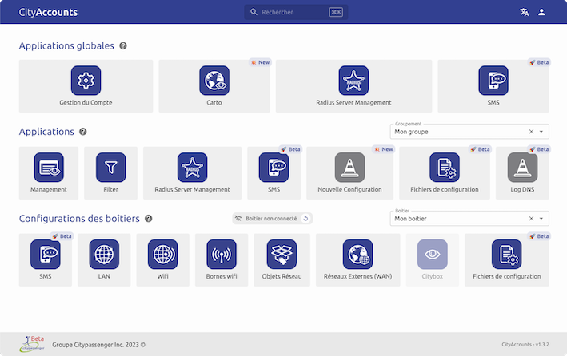
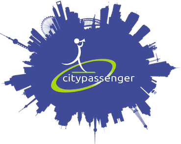

<h1><a href="https://citypassenger.com" target="_blank">Citypassenger</a></h1>

Nous créons de la valeur pour votre IT.

[✨ Nouvelle interface disponible ✨](#-nouvelle-interface)
 
## ☁️ Wifi et pare-feu dans le Cloud et par abonnement

Nous virtualisons votre réseau IT
nous créons des services IT adaptés à votre métier et exigences professionnelles

## 📟 Équipement

Nous fournissons un routeur universel tout en un pour votre réseau informatique ainsi
que le nombre de bornes wifi nécessaires. Vous nous dites où vous souhaitez avoir du Wifi,
nous nous engageons sur la couverture ! Notre matériel (routeur et bornes Wifi) est garanti
durant toute la durée de l'abonnement.

## 🛠️ Services par outils métiers ou par fonction réseaux

Vous choisissez les services de connectivité dont vous avez besoin pour votre métier : connecter
un TPE, une tablette, la vidéosurveillance, la VOIP, une PLV ou tout autre équipement.
Nous nous occupons de la sécurité nécessaire à y associer. Et bien sur, vous avez également
la possibilité de choisir vos services par fonctions traditionnelles IT que nous customiserons
selon vos besoins : filtrage des accès HTTPS, liste noire, liste blanche, stockage des logs en
conformité avec la LCEN, wifi pour vos invités, sécurité renforcée pour les personnes itinérantes,
back-up automatisé, PRA et bien sur VPN intersites et télétravail.

## 📈 Contrôle

La console web vous permet un accès et une prise en main à votre réseau 24/7.
Accès dédiés pour vos équipes et prestataires extérieurs.
Notre interface s'intègre également à vos outils de gestion de tickets. De nombreuses remontées d'alertes
sont possibles et intégrées, demandez-nous !

## 🤝 Assistance & Expertise

Nos télé-consultants vous assistent en vous accompagnant dans vos problèmes réseaux quotidiens
et plus généralement dans vos choix d'architecture réseaux et leurs évolutions.
À la demande, notre équipe itinérante et notre réseau de prestataires qualifiés,
interviennent également en moins de 2 heures sur votre site.

## ✨ Nouvelle interface

La nouvelle interface [Cityscope](https://admin.citypassenger.com/Accounts) présente de manière érgonomique l'ensemble des fonctions réseaux de vos boitiers. Elles vous permet d'accèder en un clic aux applications qui vous sont utiles.
[En savoir plus](https://github.com/Groupe-Citypassenger-Inc/cityscope).

Un problème, une question ou une demande lié à l'interface ? [Créer une isssue](https://github.com/Groupe-Citypassenger-Inc/cityscope/issues).

 
 

